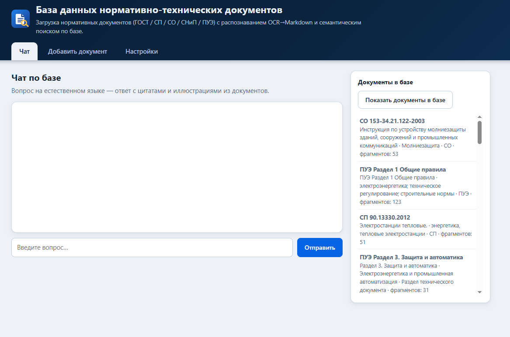
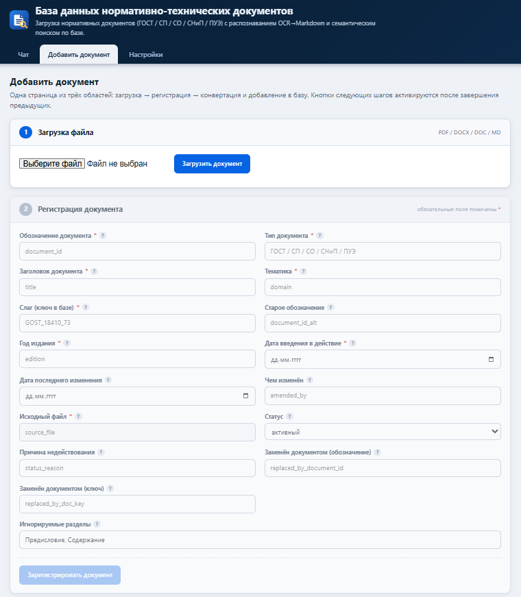
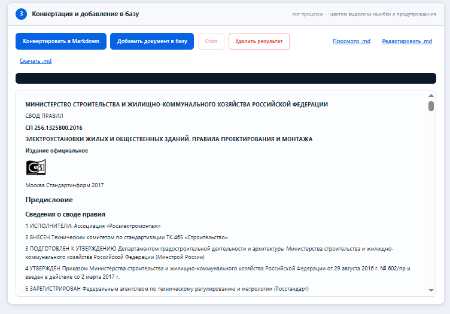
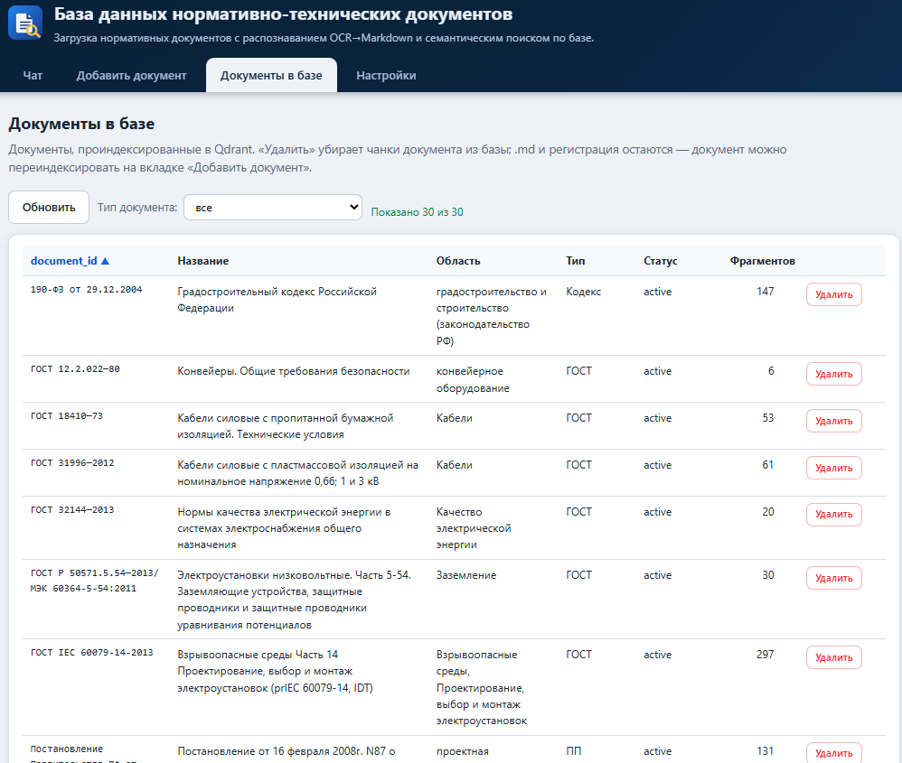
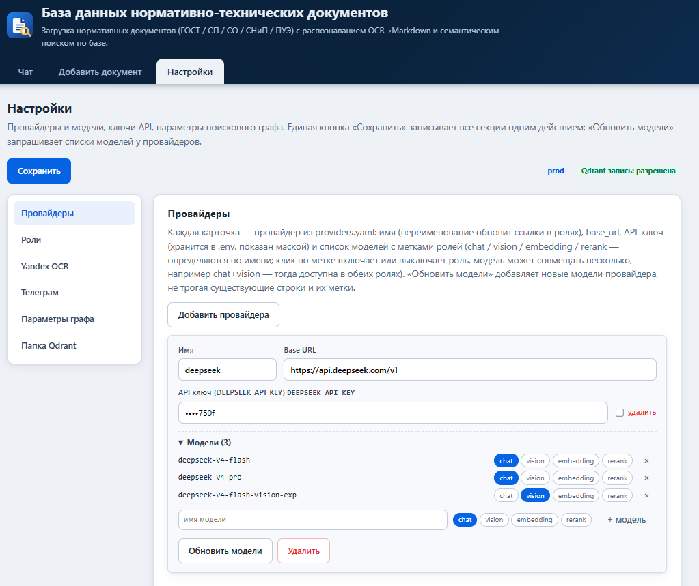

# rag-pipeline

Монорепозиторий системы вопрос-ответ по нормативным документам (ГОСТ, СП, СНиП и др. — типы задаются в `document_types.yaml`): преобразование PDF/DOCX в структурированный Markdown, построение гибридного поискового индекса в Qdrant и веб-интерфейс RAG с чатом.

## Схема работы

```
PDF/DOCX ──create_markdown──▶ Markdown ──build_search_index──▶ Qdrant (dense + sparse)
                                                                    │
        Telegram-бот / веб-чат ◀──генерация ответа (LLM + реранк) ◀─┘
                    ▲
        interface_rag (веб-панель управления всем конвейером)
```

## Состав

| Каталог | Устанавливается как | Назначение |
|---|---|---|
| `create_markdown/` | `Create_Markdown_YA` | Распознавание PDF/DOCX → Markdown: Yandex Vision OCR (модель math-markdown), таблицы с двойной обработкой (текстовый слой + vision по ID-маркерам), AI-постобработка (DeepSeek / Gemini через Provod) |
| `build_search_index/` | `Build_Search_index` | Индексация Markdown в Qdrant и QA-система: гибридный поиск (dense + sparse BM25), реранк, LangGraph-граф с LLM-генерацией ответов, Telegram-бот |
| `interface_rag/` | `interface_RAG` | Веб-интерфейс (FastAPI): чат с базой, загрузка и регистрация документов, перечень и удаление документов в базе, настройки провайдеров/поиска/папок, управление Telegram-ботом |

## Части пайплайна

### 1. create_markdown — конвертация документов

#### YandexOCR

Основное распознавание документов выполняет YandexOCR. Для его работы нужно:

1. Завести аккаунт на [https://aistudio.yandex.ru/](https://aistudio.yandex.ru/).
2. Получить API-ключ (и ID каталога `folder_id`). Для аутентификации в AI Studio необходим идентификатор каталога. Чтобы его получить, в интерфейсе AI Studio наведите указатель на название каталога, расположенное в верхней части экрана, и нажмите . Идентификатор будет скопирован в буфер обмена.
3. Вписать их в переменные `YANDEX_API_KEY` и `YANDEX_FOLDER_ID` — через веб-интерфейс (**Настройки**, раздел переменных окружения) или прямо в общий `.env`.

Без ключа конвертация PDF/DOCX не запустится (только AI-постобработка готовых `.md` доступна без OCR).

#### Работа скрипта

Скрипт `firmware/src/create_markdown.py` распознаёт текст, таблицы, формулы и изображения из документов и собирает структурированный Markdown.

- **Вход**: `.pdf`, `.docx`, `.doc` (DOCX/DOC предварительно конвертируются в PDF через LibreOffice) или готовый `.md`.
- **OCR**: основное распознавание — YandexOCR (Yandex Vision OCR, модель math-markdown); заголовки разделов восстанавливаются из структуры JSON.
- **Таблицы**: двойная обработка — распознавание из текстового слоя + vision-распознавание из картинок; AI сверяет обе версии по ID-маркерам и возвращает исправленную таблицу на исходное место.
- **AI-постобработка** (`--ai`): единый проход LLM (DeepSeek / Gemini через Provod) — коррекция таблиц, очистка OCR-артефактов, LaTeX, подписи и примечания.
- **RAG-подготовка** (`--rag`): генерация `rag_chunks.jsonl` для индексации; метаданные документа — в per-document `<stem>_reg.yaml` (`--reg`).
- **Выход**: `<корень>/Markdown/<документ>/` — итоговый `document.md` с картинками и временными артефактами; временные данные — в `<корень>/tmp/`.

Пример:

```bash
cd create_markdown/firmware/src
python3 create_markdown.py -i document.pdf --ai --rag
```

Корень базы задаётся флагом `--base-dir` или переменной `BASE_DIR` (по умолчанию — папка с входным файлом).

### 2. build_search_index — индексация и RAG

Набор скриптов `firmware/src/`:

- **`create_index.py`** — индексация Markdown-документа в Qdrant: чанкинг, dense-векторы (fastembed/SiliconFlow) + sparse BM25, метаданные из `rag_chunks.jsonl` и `<stem>_reg.yaml`.
- **`search.py`** — гибридный поиск: dense + sparse с взаимным ранжированием, реранк модели с ролью `rerank`, фильтры по типу/домену документа.
- **`qa_graph.py`** — QA-система на LangGraph: анализ запроса → (при неоднозначности) уточняющий вопрос → поиск → самооценка результатов (ре-поиск при необходимости) → генерация ответа с цитатами (ID чанков) и иллюстрациями. Конфигурация узлов (temperature, max_tokens) — в `search_config.yaml`, редактируется через веб-панель.
- **`telegram_bot/request_bot.py`** — Telegram-бот поверх `QAGraph`: тот же RAG-ответ в чате Telegram. Запускается systemd-юнитом `interface-rag-bot.service`, ключи — из общего `.env`.

### 3. interface_rag — веб-интерфейс

FastAPI-приложение (`firmware/src/app.py`), объединяющее оба пайплайна под единым UI: приёмка и регистрация документов, конвертация, индексация, семантический поиск и чат по базе.

#### Чат

Ответы по базе с потоковой отдачей (WebSocket), уточняющими вопросами при неоднозначном запросе, цитатами (ID чанков), списком источников и релевантными иллюстрациями из документов.



#### Добавление документа

Загрузка PDF → авторегистрация: vision-LLM извлекает с титульного листа метаданные (`document_id`, `title`, `domain_hint`, `document_type`, `date_enacted`) с возможностью ручной правки; далее — конвертация и индексация одним кликом с прогрессом и журналом событий. Типы документов — только из конфига `document_types.yaml` (сид с дефолтами ставится установщик; новый тип, введённый вручную, дописывается в конфиг автоматически).





#### Документы в базе

Таблица проиндексированных документов из Qdrant: `document_id`, название, область, тип, статус и число фрагментов — с сортировкой по колонкам и фильтром по типу документа. Кнопка «Удалить» убирает чанки выбранного документа из базы (`.md` и регистрация сохраняются — документ можно переиндексировать); удаление доступно при разрешённой записи в Qdrant (`qdrant.write_enabled`).



#### Настройки

- **Провайдеры**: список LLM-провайдеров, роли (chat / embedding / rerank / vision), проверка доступности, добавление и удаление.
- **Папки**: корень документов (`BASE_DIR`) и путь к базе Qdrant (`QDRANT_PATH`) — выбор папки на сервере через обзорник, размер и очистка временных файлов `tmp/`.
- **Поиск**: параметры узлов QA-графа (temperature, max_tokens), конфигурация конвертации, переменные окружения (`.env`).
- **Телеграм**: статус и перезапуск бота.



Все настройки сохраняются в общий `.env` и конфиги, которые читают оба пайплайна и бот, — менять их можно на лету без правки файлов на сервере.

## Установка

### Установочный скрипт

`scripts/install.sh` ставит всё на чистую машину с Debian/Ubuntu и systemd: системные пакеты, venv с зависимостями всех трёх компонентов, прод-макет в каталоге установки (`<install>/{interface_RAG,Create_Markdown_YA,Build_Search_index,config,venv}`), генерацию `config.yaml`, `.env` с плейсхолдерами ключей (права 0600), systemd-юниты веб-интерфейса и Telegram-бота с автозапуском. В конце печатает адрес веб-интерфейса.

Опции:

| Опция | По умолчанию | Описание |
|---|---|---|
| `--install-dir` | `/opt/rag-pipeline` | Каталог установки (всего пайплайна) |
| `--base-dir` | `/mnt/sdb/!База_ГОСТ` | Корневая папка документов (`BASE_DIR`) |
| `--host` | `127.0.0.1` | Адрес, на котором слушает веб-интерфейс: `127.0.0.1` (только локально) или `0.0.0.0` (все адреса) |
| `--port` | `8081` | Порт веб-интерфейса |

Без флагов скрипт спрашивает те же параметры интерактивно. Дефолт базы Qdrant при установке — `<install-dir>/qdrant`.

### Установка с GitHub

```bash
git clone https://github.com/dimbas80/rag-pipeline.git
cd rag-pipeline
sudo scripts/install.sh
# или с явными параметрами:
sudo scripts/install.sh --install-dir /opt/rag-pipeline \
     --base-dir /mnt/sdb/!База_ГОСТ --host 0.0.0.0 --port 8081
```

### Локальная установка (из имеющегося клона)

```bash
cd /path/to/rag-pipeline
sudo scripts/install.sh --install-dir /opt/rag-pipeline --host 127.0.0.1 --port 8081
```

### После установки

1. Откройте веб-интерфейс (адрес печатает скрипт), раздел **Настройки → Телеграм**: введите `TELEGRAM_BOT_TOKEN`, а в переменных окружения — ключи `YANDEX_API_KEY`/`YANDEX_FOLDER_ID` (см. «Регистрация YandexOCR») и остальные API-ключи; нажмите «Перезапустить бота».
2. Корень документов уже записан (`BASE_DIR`); меняется в **Настройки → Папки** (кнопка «Добавить» открывает обзор папок на сервере).
3. После смены папок перезапустите бота в разделе «Телеграм».

Ключи из `.env` читают все компоненты: веб-интерфейс, пайплайны (запускаются им как дочерние процессы) и бот (systemd `EnvironmentFile`).

## Разработка (без установки)

```bash
# веб-интерфейс
pip install -r interface_rag/firmware/src/requirements.txt
cd interface_rag/firmware/src
python -m uvicorn firmware.src.app:app --host 127.0.0.1 --port 8081

# тесты
python -m pytest interface_rag/firmware/tests/
python -m pytest create_markdown/firmware/tests/test_base_dir.py
```

Конфигурация dev/prod — `interface_rag/config.yaml` (`active: dev|prod`). Деплой на прод-хост: `interface_rag/scripts/deploy.sh` (по умолчанию dry-run, реальный деплой — `--apply`; подключение — `interface_rag/scripts/deploy.conf`, шаблон: `deploy.conf.example`).

## История

Каждый каталог перенесён со своей полной git-историей через `git subtree` (merge-коммиты `subtree:` в логе). История конкретного компонента: `git log --follow <каталог>`.
