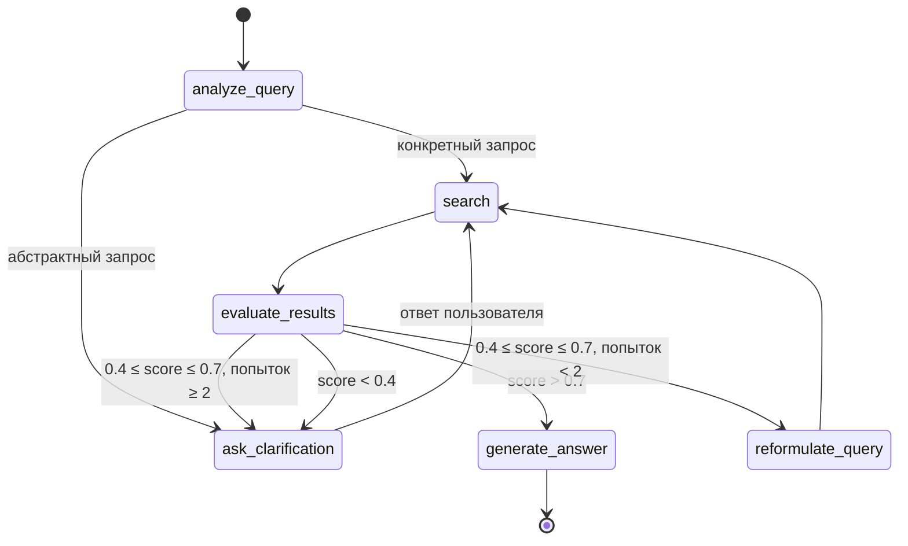

# Архитектура LangGraph QA-системы для нормативных документов

## 1. Обзор

QA-система вопросно-ответного поиска по нормативным документам (ГОСТ, СП, СНиП),
оркестрируемая LangGraph. Система принимает пользовательский запрос на русском языке,
выполняет гибридный поиск в Qdrant, оценивает качество результатов и либо генерирует
ответ с цитатами, либо уточняет запрос через диалог с пользователем.

### 1.1. Ключевые свойства

| Свойство | Значение |
|---|---|
| Язык | Русский (запросы, ответы, подсказки) |
| Модель LLM | `deepseek-v4-flash` (DeepSeek API) |
| Векторная БД | Qdrant (локальный диск), коллекция `technical_standard` |
| Dense-эмбеддинг | `Qwen/Qwen3-Embedding-8B` (SiliconFlow) |
| Sparse-эмбеддинг | `Qdrant/bm25` (локальный fastembed) |
| Реранкер | `Qwen/Qwen3-Reranker-8B` (SiliconFlow) |
| Оркестрация | LangGraph `StateGraph` |
| Человек-в-цикле | `interrupt()` на узле `ask_clarification` |
| Цитаты | `[Документ, пункт/таблица]` — обязательны |

---

## 2. Системный контекст

### 2.1. Карта компонентов

```
┌─────────────────────────────────────────────────────────────────┐
│                        qa_graph.py (новый)                       │
│                                                                  │
│  ┌──────────┐   ┌────────┐   ┌────────────────┐   ┌───────────┐ │
│  │ analyze_ │   │        │   │   evaluate_    │   │ generate_ │ │
│  │  query   │──▶│ search │──▶│   results      │──▶│  answer   │ │
│  └──────────┘   └────────┘   └────────────────┘   └───────────┘ │
│       │              ▲         │         ▲              │        │
│       ▼              │         ▼         │              │        │
│  ┌──────────┐        │    ┌──────────┐   │              │        │
│  │  ask_    │────────┘    │reformulate│──┘              │        │
│  │clarification│          │  _query   │                  │        │
│  └──────────┘             └──────────┘                  │        │
│       │                                                  │        │
│       │  interrupt()                                     │        │
│       ▼                                                  ▼        │
│  [ожидание ответа                                  [конечный      │
│   пользователя]                                     ответ]        │
└─────────────────────────────────────────────────────────────────┘
         │                    │                       │
         ▼                    ▼                       ▼
┌─────────────────┐  ┌───────────────┐  ┌───────────────────────┐
│  search.py       │  │  Qdrant       │  │  SiliconFlow API      │
│  (существующий)  │  │  (локальный)  │  │  - Chat Completions   │
│                  │  │               │  │  - Embeddings         │
│  - hybrid_search │  │  коллекция:   │  │  - Rerank             │
│  - rerank_       │  │  technical_   │  │                       │
│    siliconflow   │  │  standard     │  │  base_url:            │
│  - filter_by_    │  │               │  │  SILICONFLOW_BASE_URL │
│    rrf_score     │  └───────────────┘  └───────────────────────┘
└─────────────────┘
```

### 2.2. Интеграция с существующими компонентами

| Компонент | Файл | Использование в графе |
|---|---|---|
| `hybrid_search()` | `search.py` | Узел `search`: retrieve из Qdrant |
| `rerank_siliconflow()` | `search.py` | Узел `search`: реранк результатов |
| `filter_by_rrf_score()` | `search.py` | Узел `search`: distance-фильтр перед реранком |
| `build_payload_filter()` | `search.py` | Опционально: фильтрация по domain/doctype |
| `QdrantClient` | `search.py` | Один экземпляр, разделяемый между вызовами |
| `SparseTextEmbedding` | `search.py` | Один экземпляр, ленивая инициализация |

Интеграция — **прямой импорт функций** (не subprocess):
- Нет накладных расходов на запуск процесса
- Прямой доступ к результатам (PointStruct → dict)
- Переиспользование QdrantClient и SparseTextEmbedding между вызовами графа

---

## 3. Определение состояния графа (State)

```python
from typing import TypedDict, Annotated, Sequence
from langgraph.graph.message import add_messages
from langchain_core.messages import BaseMessage


class QAGraphState(TypedDict):
    """Состояние QA-графа."""

    # ── Входные данные ──
    query: str
    """Исходный запрос пользователя (неизменен на протяжении всего графа)."""

    # ── Диалог ──
    messages: Annotated[Sequence[BaseMessage], add_messages]
    """История диалога: system, user, assistant — для контекста уточнений."""

    # ── Результаты поиска ──
    search_results: list[dict]
    """Результаты поиска после retrieve + rerank.
    Каждый элемент — словарь из result_to_dict() (search.py):
    {rank, score, rrf_score, quality, chunk_id, document_id,
     document_type, domain, title, status, section_path,
     heading_texts, text, references, assets}
    """

    # ── Управление потоком ──
    reformulate_count: int
    """Счётчик попыток переформулирования запроса (0..2)."""

    # ── Классификация запроса ──
    query_analysis: dict | None
    """Результат analyze_query: {is_concrete: bool, key_terms: list[str],
    suggested_clarification: str | None}"""

    # ── Промежуточные данные ──
    active_query: str
    """Текущий поисковый запрос (может отличаться от исходного после
    reformulate_query или уточнения)."""

    # ── Выход ──
    final_answer: str | None
    """Итоговый ответ пользователю (с цитатами) или None если ещё не готов."""

    needs_clarification: str | None
    """Если не None — текст уточняющего вопроса для пользователя.
    Устанавливается узлом ask_clarification, очищается после ответа."""

    # ── Обработка ошибок ──
    error: str | None
    """Сообщение об ошибке, если что-то пошло не так."""
```

---

## 4. Структура графа

### 4.1. Узлы и рёбра

```
START
  │
  ▼
analyze_query ──────────────────────┐
  │ (если неконкретный)             │ (если конкретный)
  ▼                                 │
ask_clarification                   │
  │ interrupt()                     │
  │ [ждём ответ пользователя]       │
  │                                 │
  ▼                                 │
search ◄────────────────────────────┘
  │
  ▼
evaluate_results ──────────────────────────────────────────────┐
  │ score > 0.7 (хорошо)                                       │
  │ score 0.4–0.7 (средне) + count < 2                         │
  │ score 0.4–0.7 (средне) + count >= 2                        │
  │ score < 0.4 (плохо)                                        │
  ▼                                                            │
generate_answer   reformulate_query   ask_clarification   ask_clarification
  │                    │                                        │
  ▼                    ▼                                        │
 END               search (цикл)                                │
```

### 4.2. Формальное описание рёбер

| Источник | Условие | Назначение |
|---|---|---|
| `START` | — | `analyze_query` |
| `analyze_query` | `is_concrete == True` | `search` |
| `analyze_query` | `is_concrete == False` | `ask_clarification` |
| `ask_clarification` | после interrupt | `search` |
| `search` | — | `evaluate_results` |
| `evaluate_results` | `max_score > 0.7` | `generate_answer` |
| `evaluate_results` | `0.4 <= max_score <= 0.7` AND `reformulate_count < 2` | `reformulate_query` |
| `evaluate_results` | `0.4 <= max_score <= 0.7` AND `reformulate_count >= 2` | `ask_clarification` |
| `evaluate_results` | `max_score < 0.4` | `ask_clarification` |
| `reformulate_query` | — | `search` |
| `generate_answer` | — | `END` |

---

## 5. Спецификации узлов

### 5.1. `analyze_query`

**Ответственность**: классифицировать запрос пользователя — достаточно ли он конкретен
для эффективного поиска.

**Вход**: `state["query"]`, `state["messages"]`

**Выход**: `state["query_analysis"]`, `state["active_query"]`

**Логика**:

1. Вызвать LLM с промптом анализа запроса.
2. Распарсить ответ: `is_concrete`, `key_terms`, `suggested_clarification`.
3. Установить `active_query = query`.
4. Если `is_concrete == False` и есть `suggested_clarification` — НЕ устанавливать
   `needs_clarification` здесь; это сделает узел `ask_clarification`.

**Промпт (системный)**:

```
Ты — анализатор поисковых запросов к базе нормативных документов
(ГОСТ, СП, СНиП, СанПиН).

Твоя задача: определить, достаточно ли конкретен запрос для эффективного
поиска в векторной базе нормативных документов.

Конкретный запрос содержит:
- Название или номер документа (ГОСТ 31996, СП 89.13330)
- Предмет поиска (высота молниеотвода, сечение кабеля)
- Технические термины

Абстрактный запрос:
- "расскажи про нормативы"
- "какие есть требования"
- "что нужно знать про..."

Верни JSON:
{
  "is_concrete": true/false,
  "key_terms": ["список", "ключевых", "терминов"],
  "suggested_clarification": "уточняющий вопрос или null"
}
```

**Валидация**: если LLM вернул не-JSON — fallback: `is_concrete=True` (пропускаем в search).

---

### 5.2. `search`

**Ответственность**: выполнить гибридный поиск (dense+sparse) в Qdrant и реранк
через SiliconFlow Rerank API.

**Вход**: `state["active_query"]`

**Выход**: `state["search_results"]`

**Логика**:

1. Получить `active_query` из состояния.
2. Вызвать `hybrid_search()` из `search.py` с параметрами:
   - `query = active_query`
   - `top_k = 30` (retrieve)
   - `collection = "technical_standard"`
3. Применить `filter_by_rrf_score()` — отсев кандидатов с RRF score < 0.15.
4. Вызвать `rerank_siliconflow()` с `top_n = 6`.
5. Преобразовать результаты через `result_to_dict()` в список словарей.
6. Записать в `search_results`.

**Параметры (конфигурируемые)**:

| Параметр | По умолчанию | Описание |
|---|---|---|
| `retrieve_k` | 30 | Количество кандидатов из Qdrant |
| `final_k` | 6 | Количество результатов после реранка |
| `rrf_threshold` | 0.15 | Порог RRF-фильтра |
| `collection` | `technical_standard` | Имя коллекции Qdrant |

**Обработка ошибок**:

- `hybrid_search` не нашёл результатов → `search_results = []`
- `rerank_siliconflow` упал → fallback: использовать RRF-порядок без реранка
- Все API-ошибки → retry 3 раза с экспоненциальной задержкой (как в `search.py`)

---

### 5.3. `evaluate_results`

**Ответственность**: оценить качество результатов поиска и выбрать следующую ветку.

**Вход**: `state["search_results"]`, `state["reformulate_count"]`

**Выход**: возвращает строку-маршрут: `"generate_answer"`, `"reformulate_query"`,
или `"ask_clarification"`.

**Логика** (чистая функция, без LLM):

```python
def evaluate_results(state: QAGraphState) -> str:
    results = state["search_results"]
    count = state.get("reformulate_count", 0)

    if not results:
        return "ask_clarification"

    max_score = max(r["score"] for r in results)

    if max_score > 0.7:
        return "generate_answer"
    elif max_score >= 0.4:
        if count < 2:
            return "reformulate_query"
        else:
            return "ask_clarification"
    else:  # max_score < 0.4
        return "ask_clarification"
```

**Обоснование порогов**:
- `0.7` — адаптировано из существующей `QUALITY_GOOD = 0.72` в `search.py`; score > 0.7
  означает, что реранкер уверен в релевантности минимум одного результата.
- `0.4` — эмпирическая граница «среднего» качества; ниже — результаты практически
  бесполезны для генерации ответа.

---

### 5.4. `reformulate_query`

**Ответственность**: переформулировать запрос с использованием синонимов и
альтернативных технических терминов.

**Вход**: `state["active_query"]`, `state["query"]`, `state["search_results"]`

**Выход**: `state["active_query"]` (обновлённый), `state["reformulate_count"]` (+1)

**Логика**:

1. Сформировать промпт с исходным запросом и лучшими (но недостаточно хорошими)
   результатами поиска.
2. Вызвать LLM для генерации альтернативного запроса.
3. Обновить `active_query`.
4. Инкрементировать `reformulate_count`.

**Промпт (системный)**:

```
Ты — помощник для переформулирования поисковых запросов к базе
нормативных документов (ГОСТ, СП, СНиП).

Исходный запрос: {query}

Результаты поиска показали недостаточную релевантность.
Лучшие найденные документы:
{top_documents_summary}

Переформулируй запрос, используя:
- Синонимы технических терминов
- Альтернативные формулировки
- Номера связанных нормативов (если уместно)

Верни ТОЛЬКО переформулированный запрос, одной строкой, без кавычек.
```

**Обработка ошибок**: если LLM не ответил или ответ пустой — инкрементировать
`reformulate_count`, но оставить `active_query` без изменений.

---

### 5.5. `ask_clarification`

**Ответственность**: сгенерировать 1–2 конкретных уточняющих вопроса и
приостановить граф для ожидания ответа пользователя.

**Вход**: `state["query"]`, `state["query_analysis"]`, `state["search_results"]`,
`state["messages"]`

**Выход**: `state["needs_clarification"]` + LangGraph `interrupt()`

**Логика**:

1. Сформировать промпт с контекстом (исходный запрос, результаты анализа,
   предыдущие сообщения).
2. Вызвать LLM для генерации 1–2 уточняющих вопросов.
3. Записать вопросы в `needs_clarification`.
4. Вызвать `interrupt(needs_clarification)` — граф приостанавливается.
5. При возобновлении (ответ пользователя):
   - Добавить ответ пользователя в `messages`
   - Объединить исходный запрос с ответом: `active_query = f"{query}. Уточнение: {user_answer}"`
   - Сбросить `needs_clarification = None`

**Промпт (системный)**:

```
Ты — ассистент для уточнения поисковых запросов к нормативным документам.

Пользователь спросил: {query}

Этот запрос недостаточно конкретен / результаты поиска неудовлетворительны.

Сформулируй 1–2 КОНКРЕТНЫХ уточняющих вопроса, которые помогут сузить поиск.
Вопросы должны:
- Уточнять номер/название документа (СП, ГОСТ, СанПиН)
- Уточнять конкретный аспект (проектирование, монтаж, испытания)
- Уточнять технические параметры

Верни JSON:
{
  "questions": ["вопрос 1", "вопрос 2"]
}
```

**Механика interrupt**:

```python
def ask_clarification(state: QAGraphState) -> dict:
    questions = _generate_clarification_questions(state)
    clarification_text = "\n".join(f"• {q}" for q in questions)
    # LangGraph interrupt — граф останавливается здесь
    user_response = interrupt(clarification_text)
    # Возобновление: user_response содержит ответ пользователя
    new_query = f"{state['query']}. Уточнение: {user_response}"
    return {
        "needs_clarification": None,
        "active_query": new_query,
        "reformulate_count": 0,  # сброс счётчика при новом уточнении
    }
```

---

### 5.6. `generate_answer`

**Ответственность**: сгенерировать итоговый ответ со ссылками на конкретные
пункты нормативных документов.

**Вход**: `state["query"]`, `state["search_results"]`

**Выход**: `state["final_answer"]`

**Логика**:

1. Сформировать промпт с исходным запросом и результатами поиска (тексты чанков
   с метаданными: `document_id`, `section_path`, `heading_texts`).
2. Вызвать LLM для генерации ответа.
3. Если ответ содержит Python-код в блоке ```python ... ``` — исполнить его
   через `execute_calculation()` и вставить результат после блока кода
   (расчёты по формулам из нормативных документов).
4. Валидировать наличие цитат в ответе (regex).
5. Если цитат нет — добавить пост-инструкцию и перегенерировать (max 1 доп. попытка).

**Промпт (системный)**:

```
Ты — эксперт по нормативным документам (ГОСТ, СП, СНиП, СанПиН).
Твоя задача — ответить на вопрос пользователя, основываясь ТОЛЬКО
на предоставленных фрагментах документов.

ПРАВИЛА:
1. Отвечай на русском языке.
2. ВСЕГДА указывай источник в формате:
   [Документ, пункт/таблица]
   Примеры: [СП 89.13330.2016, п. 16.1], [ГОСТ 31996-2012, табл. 19]
3. Если информация из нескольких документов — укажи каждый:
   "Согласно СП 89 п. 16.1 ... по ГОСТ 31996 табл. 19 ..."
4. Если в результатах поиска нет ответа — честно скажи об этом
   и предложи переформулировать запрос.
5. Не выдумывай информацию, которой нет в предоставленных фрагментах.
7. Если для ответа нужен расчёт по формуле — напиши Python-код
   в блоке ```python ... ```. Используй только стандартную библиотеку.
   Вместо запятой в числах пиши точку: 1.2 а не 1,2.
   Я исполню код и покажу результат пользователю.
6. Будь краток, но точен.

ВОПРОС: {query}

НАЙДЕННЫЕ ФРАГМЕНТЫ ДОКУМЕНТОВ:
{search_results_formatted}

ОТВЕТ:
```

**Форматирование результатов поиска** для промпта:

```
[1] {document_id} | {section_path} | score: {score}
   {heading_texts}
   {text}
   (источник: {title})

[2] ...
```

**Пост-валидация цитат**:

```python
import re

CITATION_PATTERN = re.compile(
    r'\[([А-ЯЁа-яёA-Za-z0-9\s.,/\-]+?)\s*[,;]\s*(?:п\.|пп\.|табл\.|таблица|ст\.|разд\.|прил\.)\s*[\d.]+\]'
)

def has_citations(answer: str) -> bool:
    return bool(CITATION_PATTERN.search(answer))
```

Если цитат нет — однократная перегенерация с дополнительной инструкцией:
«В ответе ОБЯЗАТЕЛЬНО укажи источник для каждого утверждения в формате
[Документ, пункт].»

**Обработка пустых результатов**:

Если `search_results` пуст — не вызывать LLM, сразу установить:
```
final_answer = "К сожалению, по вашему запросу не найдено релевантных
нормативных документов. Попробуйте уточнить запрос: укажите номер ГОСТ/СП
или конкретный технический аспект."
```

**Расчёты по формулам (`execute_calculation`)**:

Ответ LLM обрабатывается функцией `execute_calculation(answer, timeout=5)`:
все блоки ```python ... ``` исполняются в отдельном subprocess, результат
вставляется сразу после блока кода:

```
```python
r0 = 30  # требуемый радиус, м
h = r0 / 1.2
print(f"Высота молниеотвода h = {h:.1f} м")
```
**Результат:**
```
Высота молниеотвода h = 25.0 м
```
```

Безопасность:
- timeout 5 секунд (защита от зависаний);
- запрещены `input()` и `while True` на этапе разбора;
- изоляция: `PYTHONPATH` очищен (нет доступа к модулям проекта),
  `cwd` — свежая временная директория (нет доступа к файлам проекта);
- используется только стандартная библиотека Python.

---

## 6. Интеграция с LLM (конфигурируемые провайдеры)

Конфигурация LLM вынесена в отдельный файл `firmware/src/llm_config.yaml`.
Любой OpenAI-совместимый провайдер подключается добавлением секции
в `providers` — без изменения кода.

### 6.1. Конфигурация провайдеров

```yaml
# firmware/src/llm_config.yaml
default_provider: deepseek
default_model: deepseek-v4-flash

providers:
  deepseek:
    base_url: https://api.deepseek.com/v1/chat/completions
    api_key_env: DEEPSEEK_API_KEY
    models:
      - deepseek-v4-flash
      - deepseek-v4-pro

  siliconflow:
    base_url: https://api.siliconflow.com/v1/chat/completions
    api_key_env: SILICONFLOW_API_KEY
    models:
      - Qwen/Qwen3.5-35B-A3B
      - Qwen/Qwen3-32B

# Параметры по узлам графа
nodes:
  analyze_query:
    temperature: 0.0
    max_tokens: 256
  reformulate_query:
    temperature: 0.3
    max_tokens: 256
  ask_clarification:
    temperature: 0.3
    max_tokens: 512
  generate_answer:
    temperature: 0.0
    max_tokens: 2048
```

### 6.2. API-интерфейс

```python
def load_llm_config(path: str | None = None) -> dict:
    """Загрузка и валидация llm_config.yaml (default_provider/default_model,
    providers[].base_url/api_key_env/models, nodes[].temperature/max_tokens).
    При отсутствии файла или некорректной структуре бросает ValueError."""

def get_chat_url(llm_cfg: dict, provider_name: str) -> str:
    """base_url провайдера (полный URL /v1/chat/completions)."""

def get_api_key(llm_cfg: dict, provider_name: str,
                override: str | None = None) -> str:
    """API-ключ провайдера: override (--api-key) → env (api_key_env) → .env."""

def llm_chat(messages: list[dict],
             config: QAGraphConfig | None = None,
             node_name: str = "generate_answer",
             provider_override: str | None = None,
             model_override: str | None = None) -> str:
    """Вызов chat completions провайдера из llm_config.yaml с retry
    (3 попытки, экспоненциальная задержка — как в search.py).
    temperature/max_tokens — из секции nodes[node_name] конфига."""
```

Порядок разрешения провайдера/модели:
1. `provider_override` / `model_override` (аргументы `llm_chat`);
2. `llm_provider` / `llm_model` (поле `QAGraphConfig`, CLI `--llm-provider` /
   `--llm-model`);
3. `default_provider` / `default_model` (llm_config.yaml).

### 6.3. Параметры LLM-вызовов по узлам

Значения задаются в секции `nodes` файла `llm_config.yaml`:

| Узел | temperature | max_tokens | Обоснование |
|---|---|---|---|
| `analyze_query` | 0.0 | 256 | Классификация — детерминированная задача |
| `reformulate_query` | 0.3 | 256 | Нужна вариативность формулировок |
| `ask_clarification` | 0.3 | 512 | Вариативность вопросов |
| `generate_answer` | 0.0 | 2048 | Фактологический ответ, без вымысла |

### 6.4. Модель

По умолчанию — `deepseek-v4-flash` (DeepSeek API). Модель и провайдер
переключаются без изменения кода:
- правкой `default_provider` / `default_model` в `llm_config.yaml`;
- на лету через CLI: `--llm-provider siliconflow --llm-model Qwen/Qwen3-32B`.

Обоснование выбора deepseek-v4-flash по умолчанию:
- Быстрая и недорогая модель для оркестрации и генерации ответов
- Хорошая поддержка русского языка
- Достаточный контекст для нескольких чанков документов

### 6.5. Ключи API

Ключи провайдеров задаются в `llm_config.yaml` через `api_key_env`:

| Ключ | Провайдер | Назначение |
|---|---|---|
| `DEEPSEEK_API_KEY` | DeepSeek | LLM-чат (все узлы графа) |
| `SILICONFLOW_API_KEY` | SiliconFlow | Embedding + Rerank (search_node, search.py) |

Порядок разрешения ключа LLM-провайдера (`get_api_key`):
1. `--api-key` (CLI) / `QAGraphConfig.llm_api_key` — переопределяет ключ
   из конфига;
2. переменная окружения из `api_key_env` (`DEEPSEEK_API_KEY` и т.п.);
3. `.env` файл (через `python-dotenv`).

Ключ SiliconFlow для embedding/rerank разрешается как раньше —
`SILICONFLOW_API_KEY` через `resolve_api_key()` в `search_node`.

---

## 7. Обработка ошибок

### 7.1. Стратегия на уровне графа

| Ситуация | Действие |
|---|---|
| LLM API недоступен (сетевой сбой) | Retry 3× с backoff; исчерпаны → `error=...` → END с fallback-ответом |
| LLM вернул не-JSON (анализ/уточнение) | Fallback: пропустить узел, продолжить по умолчательному маршруту |
| Qdrant недоступен | `error=...` → END с сообщением «Поиск временно недоступен» |
| Rerank API недоступен | Fallback: использовать RRF-порядок без реранка |
| `search_results` пуст после реранка | evaluate_results → `ask_clarification` |
| 3 цикла reformulate→search без успеха | evaluate_results → `ask_clarification` |

### 7.2. Единая retry-функция

Все вызовы SiliconFlow API (чат, эмбеддинг, реранк) используют общую retry-логику,
идентичную существующей в `search.py`:

```python
API_RETRIES = 3
API_RETRY_BACKOFF = 2.0
API_TIMEOUT = 120
```

---

## 8. Конфигурация

Конфигурация графа — через `config_schema` LangGraph и/или параметры конструктора:

```python
@dataclass
class QAGraphConfig:
    # Qdrant
    qdrant_path: str = "./qdrant_data"
    collection: str = "technical_standard"

    # Поиск
    retrieve_k: int = 30
    final_k: int = 6
    rrf_threshold: float = 0.15

    # LLM (провайдеры/модели/параметры — в llm_config.yaml, раздел 6)
    llm_config_path: str = DEFAULT_LLM_CONFIG_PATH  # firmware/src/llm_config.yaml
    llm_provider: str | None = None   # CLI --llm-provider
    llm_model: str | None = None      # CLI --llm-model
    llm_api_key: str | None = None    # CLI --api-key (переопределяет ключ из конфига)

    # API
    siliconflow_api_key: str | None = None
    siliconflow_base_url: str = "https://api.siliconflow.com"

    # Пороги оценки
    score_good_threshold: float = 0.7
    score_medium_threshold: float = 0.4
    max_reformulate_attempts: int = 2
```

---

## 9. Структура файлов

```
firmware/src/
├── create_index.py          # существующий, НЕ ТРОГАТЬ
├── search.py                # существующий, НЕ ТРОГАТЬ
├── llm_config.yaml          # НОВЫЙ: конфигурация LLM-провайдеров (раздел 6)
├── qa_graph.py              # НОВЫЙ: LangGraph-оркестратор
│   ├── QAGraphState         # TypedDict состояния
│   ├── QAGraphConfig        # dataclass конфигурации
│   ├── load_llm_config()    # загрузка/валидация llm_config.yaml
│   ├── get_chat_url()       # base_url провайдера
│   ├── get_api_key()        # ключ провайдера (env/.env/--api-key)
│   ├── llm_chat()           # вызов chat API конфигурируемого провайдера
│   ├── analyze_query()      # узел 1
│   ├── search_node()        # узел 2
│   ├── evaluate_results()   # узел 3 (роутер)
│   ├── reformulate_query()  # узел 4
│   ├── ask_clarification()  # узел 5 (interrupt)
│   ├── generate_answer()    # узел 6
│   ├── build_graph()        # сборка StateGraph
│   └── QAGraph              # класс-обёртка (.run() / .stream())
└── requirements.txt         # добавить: langgraph, langchain-core, pyyaml

firmware/tests/
└── test_qa_graph.py         # НОВЫЙ: тесты графа (unit + integration)
```

---

## 10. План реализации

Реализация разбивается на 4 последовательных юнита. Каждый юнит независимо тестируется.

### Юнит 1: Инфраструктура LLM и состояния

**Задача**: базовая инфраструктура — состояние, конфигурация, вызов LLM.

Файлы: `qa_graph.py` (частично)

- [ ] `QAGraphState` — TypedDict
- [ ] `QAGraphConfig` — dataclass с параметрами по умолчанию
- [ ] `llm_chat()` — вызов SiliconFlow chat completions с retry
- [ ] `resolve_api_key()` — разрешение ключа
- [ ] `_format_search_results()` — форматирование результатов для промпта
- [ ] `_parse_json_response()` — безопасный парсинг JSON из ответа LLM
- [ ] `has_citations()` — проверка наличия цитат в ответе

Приёмка: unit-тесты на `llm_chat` с моком `requests`, тесты на форматирование и парсинг.

### Юнит 2: Узлы графа

**Задача**: реализация всех 6 узлов графа.

- [ ] `analyze_query()` + промпт
- [ ] `search_node()` — обёртка над функциями `search.py`
- [ ] `evaluate_results()` — роутер (чистая функция)
- [ ] `reformulate_query()` + промпт
- [ ] `ask_clarification()` + промпт + `interrupt()`
- [ ] `generate_answer()` + промпт + пост-валидация

Приёмка: unit-тесты каждого узла с моками LLM и Qdrant.

### Юнит 3: Сборка графа

**Задача**: сборка `StateGraph`, класс-обёртка `QAGraph`.

- [ ] `build_graph()` — add_node + add_edge + add_conditional_edges + compile
- [ ] `QAGraph.__init__(config)` — инициализация клиентов, sparse-эмбеддера
- [ ] `QAGraph.run(query)` — вызов `graph.invoke()` с начальным состоянием
- [ ] `QAGraph.stream(query)` — streaming-режим для отслеживания прогресса
- [ ] `QAGraph.resume(user_response)` — возобновление после interrupt

Приёмка: интеграционные тесты с моками на прохождение полного цикла графа
(хороший запрос → ответ, плохой запрос → уточнение → ответ).

### Юнит 4: CLI и интеграция

**Задача**: консольный интерфейс для ручного тестирования.

- [ ] `__main__` блок в `qa_graph.py`: `python qa_graph.py --query "..." [--interactive]`
- [ ] Интерактивный режим: цикл «запрос → ответ/уточнение → ответ пользователя → ...»
- [ ] Вывод промежуточных шагов (логирование узлов)

Приёмка: ручное тестирование с реальным Qdrant и SiliconFlow API.

---

## 11. Что НЕ делать

- **НЕ трогать** `create_index.py` и `search.py` — они остаются без изменений.
- **НЕ добавлять** новые коллекции Qdrant — используется существующая `technical_standard`.
- **НЕ менять** формат payload в Qdrant.
- **НЕ внедрять** streaming/SSE в первой версии — только синхронный `invoke()`.
- **НЕ добавлять** веб-интерфейс — только консольный CLI.
- **НЕ использовать** LangChain chains/agents — только чистый LangGraph.
- **НЕ добавлять** векторное кэширование запросов в первой версии.

---

## 12. Риски и открытые вопросы

### 12.1. Риски

| Риск | Вероятность | Влияние | Митигация |
|---|---|---|---|
| Qwen3.5-35B-A3B нестабильно парсит JSON | Средняя | Среднее | Fallback на значения по умолчанию |
| `interrupt()` плохо работает в CLI | Низкая | Высокое | Альтернатива: ручной цикл без interrupt |
| Reranker возвращает скоры ниже ожидаемых | Средняя | Среднее | Калибровка порогов по реальным данным |
| Цитаты не извлекаются при сложных формулировках | Средняя | Среднее | Пост-валидация + перегенерация |

### 12.2. Открытые вопросы

1. **Модель LLM**: `Qwen/Qwen3.5-35B-A3B` предложена как основная. При тестировании
   может потребоваться замена на `Qwen/Qwen3-32B` (быстрее, дешевле), если качество
   ответов окажется достаточным.

2. **Пороги оценки**: 0.7/0.4 — начальные значения, требуют калибровки на
   реальных запросах. Возможно, реранкер SiliconFlow даёт скоры в другом диапазоне.

3. **interrupt() в продакшене**: LangGraph `interrupt()` удобен для прототипа,
   но в продакшене может потребоваться персистентное хранение состояния диалога
   (Redis/Postgres) через `checkpointer`.

4. **Размер промпта**: 6 чанков × ~1000 токенов = 6000 токенов. Вместе с промптом —
   в пределах 8K, что безопасно для модели с контекстом 262K.

---

## 13. Приложение: Mermaid-диаграмма графа



---

*Документ создан: 2026-08-06. Версия: 1.0.*
*Архитектор: Hermes Architect (profile: architect).*
*Утверждён: ожидает review.*
